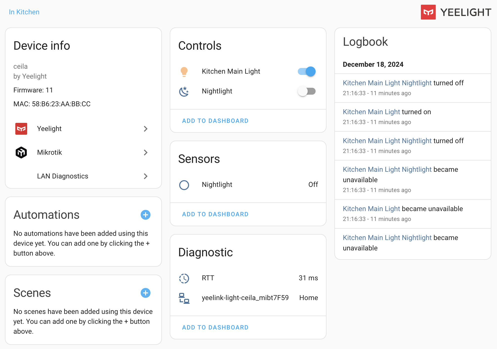

# LAN Diagnostics for Home Assistant

Home Assistant custom component to keep your LAN in order.

- Can add MAC-address to devices for integrations, that don't support it. As a result, router integrations (e.g. [Mikrotik](https://www.home-assistant.io/integrations/mikrotik/), [Keenetic](https://www.home-assistant.io/integrations/keenetic_ndms2/), [UniFi](https://www.home-assistant.io/integrations/unifi/)) will be able to add their presence sensor to such devices.
- MAC-address is added automatically, but you can also specify it manually.
- Can add ping time (RTT) sensor to your device by IP-address or MAC-address. This way you can track the stability of your network over time in the [history](https://www.home-assistant.io/integrations/history/) section.

## Installation

[HACS](https://hacs.xyz/) custom repository: `AlexxIT/LANDiagnostics`.

Or manually copy `lan_diagnostics` folder from [latest release](https://github.com/AlexxIT/LANDiagnostics/releases/latest) to `/config/custom_components` folder.

## Configuration

Add integration via Home Assistant UI.

**Add ping time sensor:**

- you can enter only IP-address, MAC-address will be detected automatically
- you can enter only MAC-address, IP-address will be detected automatically
- you can enter both IP-address and MAC-address

**Using integration only as service:**

- leave IP-address and MAC-address empty

## Usage

To automatically update MAC-addresses on all your devices you need to call action `lan_diagnostics.update_device_mac` without any params.

**Important.** It is recommended to make a backup. Incorrect device merging can be difficult to repair.

**Important.** If two different devices have the same MAC-address, there will be a collision. By default, collisions are not resolved and the setting of such MAC-addresses is skipped. Integration allows you to merge devices. One of them will become the primary device and the other will be removed. This is not a safe operation if you had any automations on the other device. So you need to manually select, which domains will be considered the primary device.

## Supported Integrations

Other integrations may be supported as well. Here is a list of known ones:

- Generic Camera
- Google Cast
- Internet Printing Protocol (IPP)
- HomeKit Device
- MikroTik
- Ping (ICMP)
- Philips TV
- Yandex Station
- Yeelight

## Tips and tricks

- It is important to first update the MAC-addresses of existing devices and only then add ping time sensors. This way the sensor will not create a new device, and will connect to an existing one.
- Mikrotik integration by default only adds trackers for the Wireless interface. In order to add sensors for all devices, the "Force scanning using DHCP" option must be enabled.
- Mikrotik integration disables trackers if no device with a MAC-address was found for them. You need to enable such trackers manually.
- You can reload the Mikrotik integration so trackers pick up their devices.
